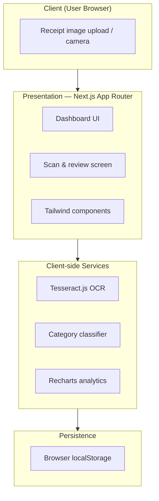
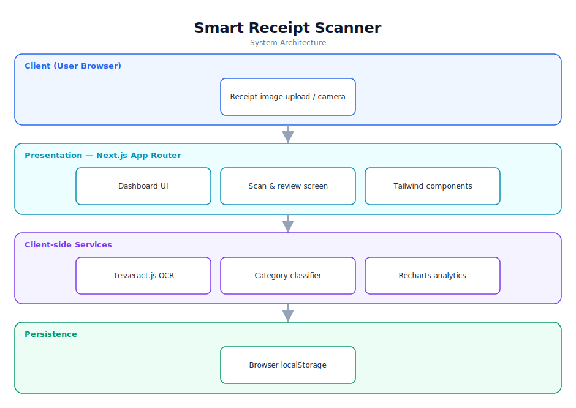

# Smart Receipt Scanner — Software Documentation

> Scan receipts in the browser, extract data with on-device OCR, and track spending.

**Repository:** [`smart-receipt-scanner`](https://github.com/Monametsi-s/smart-receipt-scanner)  
**Type:** Client-side web application  
**Status:** Complete / functional

---

## 1. Overview

Smart Receipt Scanner is a privacy-first web application that lets users photograph or upload a receipt and automatically extracts the merchant, total, and date using on-device OCR. Extracted transactions are categorised and visualised on a spending dashboard. Because OCR runs in the browser via Tesseract.js and data is stored in the browser, no receipt data ever leaves the user's device.

## 2. System Architecture

The diagram below shows the high-level architecture and how data flows between layers. It renders automatically on GitHub (Mermaid) and is also committed as a vector image ([`architecture.svg`](architecture.svg)).



<p align="center"></p>

### 2.1 Component responsibilities

| Layer | Responsibility |
|---|---|
| **Client** | Captures or uploads receipt images and renders the UI. |
| **Presentation (Next.js)** | App Router pages and React components for the dashboard and scan flow. |
| **Client-side services** | Runs OCR (Tesseract.js), classifies expenses by keyword, and renders charts (Recharts). |
| **Persistence** | Stores receipts and budget data in the browser's localStorage. |

## 3. Technology Stack

| Area | Technology |
|---|---|
| Framework | Next.js 15 (App Router) |
| Language | TypeScript |
| Styling | Tailwind CSS |
| OCR | Tesseract.js (client-side) |
| Charts | Recharts |
| Icons | Lucide React |
| Storage | Browser localStorage |

## 4. Assumed User Requirements

_These requirements are inferred from the project's purpose and feature set; they document the intended behaviour rather than a formally agreed specification._

### 4.1 Functional requirements

- **FR-01** — Allow the user to upload or capture a receipt image (JPG/PNG).
- **FR-02** — Run OCR on the image and extract merchant name, total amount, and date.
- **FR-03** — Automatically classify the receipt into a spending category from keywords.
- **FR-04** — Let the user review and correct extracted fields before saving.
- **FR-05** — Persist saved receipts locally and display them in a transaction list.
- **FR-06** — Show a spending dashboard with category breakdown and monthly budget tracking.

### 4.2 Representative user stories

- As a budget-conscious user, I want to snap a receipt and have its total captured automatically so I don't type it in.
- As a privacy-conscious user, I want my receipt data to stay on my device.
- As a user, I want to see where my money goes by category each month.

### 4.3 Non-functional requirements

- OCR must run client-side so no receipt data is transmitted to a server.
- The interface must be responsive across mobile and desktop.
- A receipt should be processed within a few seconds on a typical device.

## 5. Assumed System Requirements

### 5.1 End-user (runtime) requirements

- A modern desktop or mobile web browser (latest Chrome, Edge, Firefox, or Safari) with JavaScript enabled.
- A stable internet connection for the initial page load.
- Sufficient device memory to run in-browser OCR (a modern phone or laptop).

### 5.2 Server / hosting requirements

- None — this project runs entirely on the client; no application server is required.

### 5.3 External services & API keys

- None — the application has no third-party service dependencies at runtime.

### 5.4 Developer / build requirements

- Node.js 18+ and npm (or yarn/pnpm).
- Git for cloning the repository.
- A code editor such as VS Code (recommended).

## 6. Data Model

Receipts are stored as JSON objects in localStorage, each with: `id`, `merchant`, `total`, `date`, `category`, and `imageRef`. Aggregations (per-category totals, monthly spend) are computed on the client at render time.

## 7. Setup & Installation

```bash
git clone https://github.com/Monametsi-s/smart-receipt-scanner.git
cd smart-receipt-scanner
npm install
npm run dev
# open http://localhost:3000
```

## 8. Assumptions & Future Considerations

- Add an optional cloud backend (e.g. Supabase/Convex) for cross-device sync.
- Add JSON export/import for backup.
- Improve OCR accuracy with image pre-processing (deskew, contrast).

---

<sub>This document was generated as part of a portfolio-wide documentation pass. User and system requirements are **assumed** from the codebase, README, and project intent, and should be validated against real product goals before being treated as authoritative.</sub>
